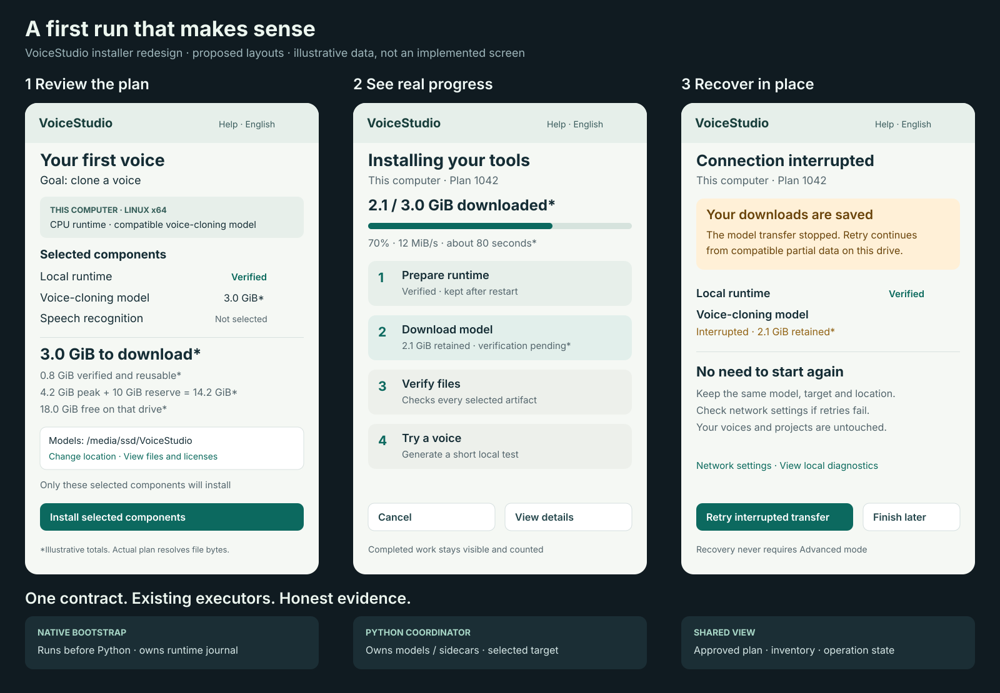

# Installer proposal: one approved plan and recoverable progress

**Proposed design only.** Source-review baseline (2026-10-04):
[`fb9a960c88744edc36daf2cf38d48df0971ee713`](https://github.com/debpalash/VoiceStudio/commit/fb9a960c88744edc36daf2cf38d48df0971ee713)
(app 0.5.6). This documentation-only change implements none of the behavior below.
The branch was integrated with main on 2026-10-05; see the [integration refresh](review.md#integration-refresh-2026-10-05)
for landed changes and current overlap. Historical probes remain pinned to their original baseline.

- [Remaining findings, merged fixes and open-PR overlap](review.md)
- Current behavior: [runtime](../../electron-runtime.md), [model downloads](../../downloading-models.md),
  [repair](../../electron-repair.md), [uninstall](../../install/uninstall.md)

## Scope and existing behavior to preserve

Keep Electron, managed Python/uv, existing engines, pinned model revisions,
segmented downloads, integrity checks, cached-byte reuse, targeted repair and
ownership-aware cleanup. Keep explicit setup consent, opt-in analytics and local
operation with telemetry declined. No version bump, Tauri revival, required cloud
service, cache migration or replacement installer framework is proposed.

Packaged CPU-only x64 bootstrap already shipped in [#2500](https://github.com/debpalash/VoiceStudio/pull/2500).
The Electron install/uninstall guides and stable-only update policy were aligned in
[#2578](https://github.com/debpalash/VoiceStudio/pull/2578).
Package-managed installs can disable the updater with `VOICESTUDIO_DISABLE_UPDATER=1`
([#2557](https://github.com/debpalash/VoiceStudio/pull/2557)). Preserve these changes.
Do not restore the removed Preview update channel or duplicate the landed and open
work listed in the [review](review.md#integration-refresh-2026-10-05).
[#2602](https://github.com/debpalash/VoiceStudio/pull/2602)'s disk-headroom, Rosetta
and runtime package-progress changes and [#2605](https://github.com/debpalash/VoiceStudio/pull/2605)'s
source CPU selection/no-sync restarts and startup fixes have now merged. Draft
[#2607](https://github.com/debpalash/VoiceStudio/pull/2607) builds Windows AMD/ROCm
desktop integration on [#2600](https://github.com/debpalash/VoiceStudio/pull/2600)'s
source recipe. Reconcile its selector, interpreter and test overlap with the landed
source/runtime changes before implementing runtime slices; the draft does not
establish shipped or qualified Windows AMD support.

## Proposed user flow

1. **Choose an outcome and target.** Offer speech, voice cloning, transcription or
   dubbing, with a conservative compatible recommendation. Keep the execution
   computer visible. A speech-only model must not be advertised as voice cloning.
   Keep Fast/Balanced/Quality/Max as optional resource choices, explaining what
   each adds. Browsing never starts installation or changes the active profile.
2. **Review the plan.** Name every selected model, dependency, runtime, license,
   destination and endpoint. Separate reusable bytes, remaining download, final
   footprint and temporary peak on each volume. Say estimated/unknown where needed;
   never show unknown as zero. Exclude unrelated ASR/dictation/translation unless
   required or selected. Recheck space and target before starting.
3. **Install with visible control.** Show Prepare → Download → Install → Verify,
   stable component rows, completed bytes, Cancel and details in the default view.
   Hide stale rates/ETA. Say when a transport can stop only after the current
   transfer; never promise immediate Pause. A renderer reload reconnects to the
   operation. App relaunch reports interruption before restarting network work.
4. **Recover in place.** Retain the failed component, cause, target, saved bytes and
   next action. Retry reuses compatible verified/partial data. Disk-full, gated
   access, incompatible wheels, corrupt artifacts and lost remote targets receive
   distinct guidance. Never silently choose another target or larger model pack.
5. **Verify the chosen capability.** Keep privacy consent independent of readiness.
   Speech/clone goals use a short original sample and an approved compatible model;
   ASR uses a tiny bundled speech fixture; dubbing uses a bounded local fixture.
   No check downloads extra assets, requires a microphone, or overwrites a draft.
   Generated audio goes through `mark_synthetic` and playback starts paused. Offer
   Retry or Enter studio without testing; skipped does not mean verified.

Persist separate facts for onboarding completion, asset integrity, selected
capability readiness and first-output verification. A positive-size cache or
completed wizard is not proof of a usable model. An installed engine can stay
usable while an unrelated optional component needs repair.

## Proposed contracts and ownership

This is a common vocabulary with existing executors, not a Python service required
before Python exists. Electron owns its bootstrap; the selected backend owns its
model/sidecar jobs. Preserve current endpoints as compatibility adapters.

| Contract | Required fields / behavior |
|---|---|
| Plan | Version, ID, expiry, target, host/process/Python architecture, recipe revision, selected component IDs, pinned artifacts/hashes, dependencies/licenses, paths, per-volume free/peak/reserve bytes and estimate confidence |
| Start | Bind the accepted plan digest to target, components, paths and licenses; idempotent start returns the same operation; material changes require a revised plan before work |
| Operation | Durable ID, plan/target, monotonic sequence, phase, per-component state, downloaded/verified bytes, retryability, allowed actions and bounded redacted diagnostics |
| Inventory | Target-bound absent/partial/verified/load-failed/incompatible states using shared catalogue/readiness rules; loading and first output remain separate evidence |

Use atomic state transitions and an ownership-checked lock per destination.
Cancellation becomes terminal only after the worker/process tree stops writing.
A vanished worker is interrupted, never successful. Keep terminal failure details
until resolved/dismissed rather than tying them to a retry cooldown. Polling returns
full snapshots; event replay must either reconcile or explicitly reset the snapshot.
Resume rechecks artifact identity, revision, range and integrity. Preserve loopback,
CSRF and remote authorization; IDs alone grant no access.

Resolve model metadata before confirmation. Before Python is available, a runtime
plan plus a labeled model estimate is honest; an invented combined exact total is
not. Group unique artifacts, extraction/copies, old-runtime retention and headroom
by filesystem, including concurrent jobs. Keep the existing 10 GiB model reserve
until a replacement policy is measured. Unknown capacity is distinct from zero.

Runtime recipes should validate OS/architecture/accelerator combinations before
network work and avoid downloading CUDA before replacing it with CPU/ROCm. The
historical recipe edges and #2605/#2607 overlap are identified in the
[review](review.md#open-pr-overlap); revalidate them against the integration refresh
and reuse the landed CPU path.
Keep host, process and Python architecture separate for Rosetta/Windows emulation.

## Platform boundaries

These are source-level distribution/runtime facts, not fresh hardware acceptance.

| Target | Current boundary to keep visible |
|---|---|
| Windows x64 | NSIS; managed Python; CPU baseline, CUDA depends on driver/engine |
| Windows ARM64 | Experimental native shell with x64-emulated Python; auto selects CPU; explicit override edge remains in the baseline review; no GPU/NPU promise |
| macOS ARM64 | DMG/ZIP; MPS/CPU and engine-specific MLX; no universal acceleration claim |
| macOS x64 | Shell can connect remotely; local runtime blocked; preserve #2602's merged Rosetta guidance |
| Linux x64 | AppImage and deb; CPU/CUDA with opt-in supported ROCm; package-manager update policy stays intact |
| Linux ARM64 | No published native desktop build; a browser connected to a supported backend is a separate path |

Keep support tier separate from evidence: supported/experimental/remote-only versus
not-run/fixture-only/native-verified. Record exact build, recipe and tested host.
Browser/Docker clients must not install on the viewing computer accidentally.

## Lifecycle and safety

- Reuse runtime and weights for a shell update with an unchanged recipe. Keep
  stable-only, architecture-specific Electron feeds and immutable legacy feeds
- A staged replacement is a proposal: create a venv in its final versioned
  directory, validate it, then switch an ownership-checked pointer. Do not move a
  constructed venv or erase the healthy runtime before verification
- Binary rollback cannot reverse arbitrary database changes. Verify backups and
  schema compatibility before offering it; failed/skipped backup is not protection
- Separate app, runtime, shared cache and personal data in removal previews.
  Preserve ownership guards and existing confirmations. A failed deletion must
  retain its recovery state and cannot be reported as successful
- Keep diagnostic export local and previewable; redact tokens, paths, user content
  and URL secrets. Sharing and optional agent escalation retain explicit consent
- Use existing components and `SearchableSelect`; translate all user-facing text
  into all 21 locales. Test keyboard/focus, screen reader, reduced motion, long
  translations and reachable recovery actions at 200% zoom / a 640×480 viewport

## Small implementation slices and acceptance

1. **Correctness first:** unify completeness/readiness; distinguish zero/unknown
   disk capacity; report actual sidecar deletion; retain failed model rows and
   Cancel in the simple view. These fixes do not require a new coordinator
2. **Plan/progress:** resolve selected components before confirmation, retain the
   full denominator and terminal results, reconcile one operation across reloads
3. **Durable recovery:** add target-owned journals/receipts, safe interruption and
   staged runtime switching incrementally, preserving public compatibility
4. **Goal-based UI:** add presets and capability-specific first output after the
   underlying truth/recovery contracts are reliable

Required regressions: config-only/missing-shard caches; zero/unknown/full disk;
locked-file removal; two simultaneous jobs where one finishes or fails; terminal
errors after 60 seconds and process restart; double start/cancel; target changes;
network interruption and corrupt artifacts; No thanks across relaunch; first-output
skip/failure; unchanged-recipe update and owned-only uninstall.

Contract tests run offline with empty model caches. Separately record packaged
fresh install, first output, relaunch/update/uninstall on macOS, Windows and Linux,
plus representative CPU/CUDA/MPS/ROCm and experimental ARM hardware. Fixtures,
source probes and WSL are not substitutes for native acceptance. Measure timing
and cache state before quoting improvement. No new RC or release ceremony is proposed.
